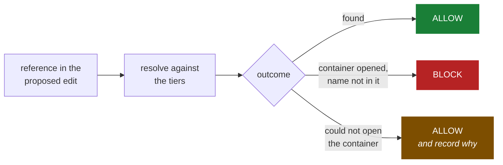

<div align="center">

# bleurs

**Ground truth for AI coding agents.**

Blocks the APIs that don't exist. Serves the ones that do. One index, both directions.

[](https://github.com/Anandb71/Bleurs/actions/workflows/ci.yml)


[](LICENSE)


</div>

bleurs is a static verifier and API projector for **Python and TypeScript** that
runs **inside the edit path** of an AI coding agent. Before a write reaches disk, it resolves
every external reference in the proposed file against the environment that code
will actually run in — the standard library, installed distributions, live
library objects, PyPI and npm, `node_modules`, and your own project's symbol
table — and rejects the edit if any reference is provably fictional. The same index answers the inverse
question, projecting exact API surfaces so an agent can learn how to call
something without reading the file that implements it.

## Results

Measured on 200 real files from `site-packages`, each rooted at its own package
so every resolution tier is active. Reproducible with two commands.

| Metric | Result | Method |
|---|---|---|
| **False positive rate** | **0.000%** (0 / 200 files) | Unmutated installed code. Every reference resolves by construction, so any block is a false positive. |
| **Hallucinations caught** | **287 / 508** (56.5%) | Planted into real files; each planted name verified absent before scoring. |
| **Judged incorrectly** | **0** | The other 221 were declined with a stated reason, not guessed at. |
| **Context reduction** | **7.3x** aggregate, 6.6x median | 393 files: 1,323,878 tokens of source → 181,326 tokens of projected surface. |
| **TypeScript, same method** | **0 / 700 files**, 822 / 827 caught | A `node_modules` of 103 packages. Disputed blocks adjudicated by Node itself. |

The third row is the one that matters. bleurs never reached a wrong verdict on a
planted hallucination — it either caught it or said out loud that it was not
judging. See [Evidence](#evidence) for methodology and how to reproduce.

TypeScript scores higher on recall (99.4% against 56.5%) for an unglamorous
reason: **it claims less.** Node's module resolution is a filesystem walk with
deterministic fallbacks, while Python's surface is dynamic. The TypeScript
front-end also does not implement class shapes or instance attributes at all —
and every single bug the Python sweep uncovered lived in exactly that tier.

## Contents

- [Installation](#installation) · [Quick start](#quick-start) · [What it detects](#what-it-detects)
- [Evidence](#evidence) · [How it works](#how-it-works) · [Reference](#reference)
- [Comparison](#comparison) · [FAQ](#faq) · [Limitations](#limitations)
- [Roadmap](#roadmap) · [Prior art](#prior-art) · [Contributing](#contributing)

---

## Installation

```bash
uv tool install git+https://github.com/Anandb71/Bleurs            # Python
uv tool install "bleurs[typescript] @ git+https://github.com/Anandb71/Bleurs"
```

The core has zero runtime dependencies: nothing to provision, no index to build,
no database. It reads the interpreter's own `ast` module and its own packaging
metadata.

TypeScript support adds tree-sitter, kept as an extra so a Python-only user
never pays for grammars they will not load.

> **PyPI release pending.** Once published this becomes `uv tool install bleurs`.

Try it without installing:

```bash
uvx --from git+https://github.com/Anandb71/Bleurs bleurs demo
```

## Quick start

### As an agent hook (the primary use)

Checking after the fact is a linter. Checking before the write is a firewall.

```bash
bleurs install-hook
```

Registers a `PreToolUse` hook on `Write`, `Edit`, and `MultiEdit`. bleurs
reconstructs what the file *would* contain after the edit, verifies it, and
rejects the tool call if any reference is provably fictional — returning the
real API of whatever the agent got wrong:

```
Bleurs blocked this edit. These references do not exist:
  - t.py:5  base64.encode_string - base64 has no attribute 'encode_string'
  - t.py:5  json.loads_safe - json has no attribute 'loads_safe'

What those containers actually provide:

base64  [module]
  b64encode(s, altchars=None)
  b64decode(s, altchars=None, validate=False)
  urlsafe_b64encode(s)
  ...

json  [module]
  dumps(obj, *, skipkeys=False, ensure_ascii=True, ...)
  loads(s, *, cls=None, object_hook=None, ...)
  ...
```

The agent corrects on the next turn because it now has the ground truth, and it
never opened a file to get it. Works with any client that can run a command on a
JSON payload — Cursor, Codex, a custom loop. It reads a tool call on stdin and
answers with an exit code.

### As an MCP server

```bash
claude mcp add bleurs -- bleurs mcp
```

Exposes `surface` (what exists) and `verify` (what doesn't). See
[MCP tools](#mcp-tools).

### On the command line

```bash
bleurs check src --exclude demo        # exit 1 if anything is blocked
bleurs surface datetime.datetime       # exact API, no file read
bleurs surface src/app/models.py --stats
```

### In CI

```yaml
- run: pip install git+https://github.com/Anandb71/Bleurs
- run: bleurs check src
```

## What it detects

| Failure | Example | Resolved by |
|---|---|---|
| Invented package | `import langchain_vectorstore_utils` | PyPI registry |
| Uninstalled real package | `import requests` (absent) | Distribution metadata → warning, never a block |
| Invented API on a real library | `json.loads_safe(raw)` | Live object introspection |
| Invented submodule | `import json.encoder_deluxe` | Live object introspection |
| Invented name in a from-import | `from json import loads_safely` | Live object introspection |
| Invented helper in your project | `from app.utils import helper_that_never_existed` | Project symbol table |
| **Invented method on your own class** | `user.emial`, `self.reposiory` | Project class shapes, with inheritance |
| Invented member of your own module | `utils.no_such_helper` | Project symbol table |
| Invented npm package | `import x from "react-hooks-utils-toolkit"` | npm registry |
| Invented scoped npm package | `import x from "@acme/intl-format-helpers"` | npm registry |
| Missing relative module | `import { x } from "./nope"` | Node resolution |
| Invented export from your own module | `import { helperr } from "./utils"` | Project exports |

The bolded row is where hallucinations in a real repository concentrate. An
agent rarely invents a standard library function; it invents a method on the
class you just showed it, and tools that only check imports pass straight over
that.

---

## Evidence

Two harnesses, both in [`benchmark/`](benchmark), both reproducible.

### Precision

```bash
python benchmark/eval_hallucinations.py --limit 200
```

Runs bleurs over unmutated files from `site-packages`. Those files are
installed, importable and working, so every reference in them resolves by
construction. **Any block is therefore a false positive** — no labelling step,
no judgement call, no opportunity to grade our own homework.

```
PRECISION  (unmutated working code; any block is a false positive)
  files checked        200
  false positives      0
  false positive rate  0.000%
```

**This number has been 0 exactly twice, and both times it took work to get
there.** The first run of this harness reported 20%; five real bugs, all fixed
([`64dbf1c`](https://github.com/Anandb71/Bleurs/commit/64dbf1c)).

Then a worse problem surfaced — in the harness itself. It built its engine
without a `project_root`, which silently disabled tier 0, so class shapes,
`self` resolution and instance-attribute checking were never measured at all
and a 0% rate was being published for a configuration nobody runs. Rooting each
file at its own package turned the tier on and the rate went to **12%**: nine
further false-positive classes, from `@staticmethod` receivers to mixins to a
project `warnings.py` shadowing the stdlib. All nine are fixed and pinned in
[`tests/test_regressions.py`](tests/test_regressions.py), one test per bug with
the library that produced it named
([`f7ec0fa`](https://github.com/Anandb71/Bleurs/commit/f7ec0fa)).

The lesson is worth stating plainly: a benchmark that does not exercise the
feature you are claiming for measures nothing, however good its number looks.

### Recall

The same real files, with one reference deliberately broken — a method renamed
to something plausible that does not exist, or a package swapped for one nobody
published. Ground truth is exact because we know what was broken and where.

```
RECALL  (planted hallucinations, each verified absent before counting)
                          caught  declined  silent
  invented API                53       116       0
  invented import name        91        99       0
  invented package           143         6       0
  overall                    287       221       0    56.5% all / 100.0% judged

  why bleurs declined to judge:
     102  module defines __getattr__, so any attribute may be valid
      56  stdlib module whose contents differ between platforms
      41  reference is inside a try/except that handles it failing
      11  resolves to project-local code we could not index
      11  dropped before judging (wildcard import, shadowed name, ...)
```

Three methodological commitments:

1. **Every planted name is verified absent before it is scored.** `os_toolkit`
   and `argparse_utils` are both real PyPI projects; a mutation that lands on
   something published is not a hallucination and is discarded.
2. **Outcomes are three-way.** A hallucination bleurs *declined* to judge is a
   miss, but a principled one, produced by the same rules that hold the false
   positive rate at zero. Folding those in with genuine blind spots would hide
   where the blind spots are.
3. **`silent` is the honest column** — cases examined and got wrong. It is zero,
   and that is the claim worth making, not the 56.5%.

### TypeScript

```bash
npm install react express lodash zod axios date-fns chalk rxjs   # a corpus
python benchmark/eval_typescript.py --corpus ./tscorpus --limit 700
```

```
PRECISION  (unmutated working code; any block is a false positive)
  files checked        700   (skipped 0, did not parse)
  false positives      0
  false positive rate  0.000%

  blocks Node also rejects (2) -- real package defects, not ours:
    * _lib/test.cjs:6 require("./test/vitest") -- no module at './test/vitest'

RECALL  (planted hallucinations, package names verified absent)
                            caught  declined  silent
  invented named import        252         5       0    98.1%
  invented package              15         0       0   100.0%
  missing relative module      555         0       0   100.0%
  overall                      822         5       0    99.4% all / 100.0% judged
```

Two methodological points the first run forced, both of which had been scoring
the corpus rather than the checker:

**Node adjudicates disputed blocks.** The first run reported two false
positives. Both were real: `date-fns` ships `_lib/test.cjs` requiring
`./test/vitest`, a file it does not publish, and `require.resolve` returns
`MODULE_NOT_FOUND`. Asking Node rather than our own resolver keeps the
measurement from being circular — and bleurs found a genuine broken import in a
package with millions of weekly downloads.

**A mutation only counts if it lands in code.** `date-fns` documents its API
with `import` examples inside JSDoc comments. The first version planted
hallucinations there and then marked the checker wrong for correctly ignoring a
comment.

Relative-path mutations are realistic typos — a dropped plural, a doubled
letter, two adjacent characters swapped — each verified unresolvable by Node
before being scored.

Still unmeasured here: tsconfig path aliases and `baseUrl` (unit-tested, but the
corpus has no tsconfig), and monorepo workspaces.

### Context reduction

```bash
python benchmark/surface_savings.py
```

393 files from `site-packages`, deliberately not this repository, whose comment
density would flatter the result.

| | |
|---|---|
| Whole files | ~1,323,878 tokens |
| Projected surfaces | ~181,326 tokens |
| **Aggregate** | **7.3x** |
| Per-file median | 6.6x |
| p25 / p75 | 4.7x / 10.7x |
| Worst / best | 1.8x / 154.6x |

Token counts are estimated at 4 chars/token rather than measured with a real
tokenizer, since shipping one would mean shipping a dependency. The estimate
applies identically to both sides of every ratio, so it cancels.

---

## How it works

### The decision rule

> **BLOCK requires positive evidence of absence.**

Not "we couldn't find it." Absence, demonstrated by a named resolver that looked
inside a container it successfully opened.



The third branch is the one most tools collapse into the second. The asymmetry
is deliberate: a missed hallucination costs one failed test run you were going
to have anyway, while a false positive costs the tool — it gets disabled, and
from that moment catches nothing. **Recall is worth spending; precision is not.**

### Resolution tiers

Cheapest and most certain first. Each answers *present*, *absent*, or *unknown*;
only the middle answer can block.

| Tier | Source of truth | Executes code | Catches |
|---|---|:--:|---|
| **0 · project** | your files, parsed into symbol tables and class shapes | no | invented helpers, methods, and attributes in your own code |
| **1 · stdlib** | `sys.stdlib_module_names` | no | invented standard library modules |
| **2 · environment** | installed distribution metadata | no | packages that are not present |
| **3 · introspection** | the live library object | **yes**, sandboxed | **invented APIs on real libraries** |
| **4 · registry** | PyPI, cached on disk | no | invented packages, slopsquatting bait |

For TypeScript and JavaScript the same discipline runs over different ground
truth, because Node has no `importlib.metadata` and no runtime introspection:

| Tier | Source of truth | Catches |
|---|---|---|
| **0 · project** | relative resolution with Node's extension and index fallbacks; exports parsed per file | missing modules, invented named exports, invented namespace members |
| **1 · builtins** | Node's own module list; any `node:` specifier | invented builtins |
| **2 · installed** | the `node_modules` walk Node itself performs | packages that are not present |
| **3 · declared** | `package.json` dependency fields | declared but uninstalled — a warning, never a block |
| **4 · registry** | npm, cached on disk | invented packages, slopsquatting bait |

A tsconfig `paths` alias is indistinguishable from a bare package by shape
alone, so anything matching an alias prefix — or any bare specifier in a project
that sets `baseUrl` — abstains rather than risking a false positive on entirely
ordinary code.

Tiers 0 and 3 also power `surface`. Projecting an API and proving one absent are
the same operation read in opposite directions, which is why both halves of this
tool are one index rather than two systems sharing a repository.

Tier 3 is the only one that executes third-party code, because there is no other
way to ask an object what it contains. It runs in a subprocess launched with
`-I`, with a timeout, batched once per check rather than once per reference, and
only for packages already installed in your environment. `--no-introspect`
disables it, after which bleurs reports that it verified no APIs rather than
implying the file is clean.

### Class shapes

Tier 0 models each class as a **shape**: its methods, class attributes,
attributes assigned onto `self`, and its base classes, with re-exports followed
across files.

A shape is **closed** when the complete attribute surface can be enumerated.
Only a closed shape may produce a block. A shape opens — and abstains — if any
base cannot be resolved, an unrecognized decorator might have replaced the
class, `__getattr__` is defined, or attributes are set dynamically.

Types are read, never inferred. A variable is bound to a class only when it is
assigned exactly once, by a plain assignment, from a bare constructor call:

```python
user = User("a@b.c")        # bound   -> user.emial blocks
user = make_user()          # unbound -> abstains (factory return type unknown)
for user in load():         # unbound -> abstains
def f(user): ...            # unbound -> abstains
```

### What it deliberately does not judge

`bleurs check --explain` reports which of these applied.

| Condition | Why |
|---|---|
| Wildcard imports | The namespace becomes unknowable |
| A name rebound anywhere in the file | All six binding forms Python offers |
| Inside `try`/`except` that would catch the failure | The author declared it optional |
| Inside a platform or version test | `sys.platform`, `os.name`, `platform.system()`, `sys.version_info` |
| Behind a `hasattr`/`getattr` guard | An explicit existence check |
| Type-only positions | `if TYPE_CHECKING:` and annotations resolve against stubs, not runtime |
| Platform-varying stdlib containers | `signal.SIGQUIT` is real on Unix; one platform cannot prove otherwise |
| Modules defining `__getattr__` (PEP 562) | Attributes are synthesized on demand |
| Chains not rooted at a known binding | `f().x`, `d["k"].y` |
| Files that fail to parse | A syntax error is not a hallucination |
| Registry lookups that failed on the network | Absence of evidence |

---

## Reference

### Commands

| Command | Purpose |
|---|---|
| `bleurs check [paths]` | Verify files or directories. Exit 1 if blocked. |
| `bleurs surface <target>` | Project the API of a module, class, or `.py` file. |
| `bleurs hook` | Run as a `PreToolUse` hook. Reads a tool call on stdin. |
| `bleurs mcp` | Run as an MCP server over stdio. |
| `bleurs install-hook` | Write the hook into `.claude/settings.json`. |
| `bleurs demo` | Run the bundled samples. |

### `bleurs check`

| Flag | Effect |
|---|---|
| `--root PATH` | Project root for local resolution. Inferred if omitted. |
| `--exclude PATTERN` | Skip paths matching a glob or directory name. Repeatable. |
| `--explain` | Also list what could not be verified, and why. |
| `--format {text,json}` | Output format. |
| `--offline` | Never contact PyPI. |
| `--no-introspect` | Never import libraries. Disables API checking. |
| `--no-strict-imports` | Warn instead of blocking on packages absent from PyPI. |

### `bleurs surface`

| Flag | Effect |
|---|---|
| `--all` | Include private (underscore) names. Use when editing the module. |
| `--no-summaries` | Names and signatures only. |
| `--stats` | Report estimated token cost against the file it replaces. |

### MCP tools

| Tool | Arguments | Returns |
|---|---|---|
| `surface` | `target`, `private?`, `summaries?`, `limit?` | Exact API of a module, class, or project file |
| `verify` | `code`, `path?` | Blocked references plus the real API of each container |

### Performance

| Operation | Time |
|---|---|
| Check one file, full pipeline | ~300 ms (~200 ms is interpreter startup) |
| Check one file, `--offline --no-introspect` | ~200 ms |

Registry answers are cached on disk, so a package name is fetched once, ever.
Introspection is batched per check, not per reference.

---

## Comparison

|  | invented package | invented API | invented method on your class | distinguishes *never published* | works pre-write | zero config |
|---|:--:|:--:|:--:|:--:|:--:|:--:|
| ruff / pyflakes | ✗ | ✗ | ✗ | ✗ | ✗ | ✓ |
| mypy / pyright | partial | ✓ | ✓ | ✗ | ✗ | ✗ |
| pip-audit | ✗ | ✗ | ✗ | known CVEs only | ✗ | ✓ |
| running the tests | ✓ | ✓ | ✓ | ✗ | ✗ | — |
| **bleurs** | ✓ | ✓ | ✓ | ✓ | ✓ | ✓ |

Type checkers cover much of this column, and if you run pyright in strict mode
you have a lot of it. Two things they do not do.

**They cannot distinguish "not installed" from "never existed."** mypy reports
`Cannot find implementation or library stub for module named 'X'` whether X is a
forgotten dependency or a name no human has published. That distinction is the
entire security story: one is a missing install, the other is an open
supply-chain hole waiting for someone to register it.

**They run after the file exists.** bleurs checks the proposed content of an
edit that has not happened, which is the only point at which it can be stopped.

---

## FAQ

<details>
<summary><b>Why not use mypy or pyright?</b></summary>

<br>

Do — they compose well. Use pyright for types and bleurs for grounding.

They require configuration, benefit enormously from annotations, need stubs for
untyped dependencies, and run on files that exist. bleurs requires none of that
and runs on the proposed edit. And a type checker cannot tell a forgotten
dependency from an unpublished name.

</details>

<details>
<summary><b>Why not a RAG index or a code-graph MCP server?</b></summary>

<br>

For finding code they are good, and several search better than bleurs does.

**Embeddings retrieve what is similar; this retrieves what is true.** A vector
index returns chunks ranked by a similarity score, and a chunk boundary can cut
a signature in half. A surface is the complete public API of a container,
derived from the runtime object or the parse tree, with no ranking step to be
wrong about.

**They do not close the loop.** A graph server answers when asked. It cannot
know the agent just wrote something false, because it is not in the write path.
bleurs is, so the moment of failure is also the moment of retrieval — the one
moment you can be certain the information is needed.

</details>

<details>
<summary><b>It imports third-party packages to check them. For a security tool?</b></summary>

<br>

The sharpest objection to the design, and the mitigation is scope.

Tier 3 only imports packages **already installed in your environment** — code
that was going to execute the moment you ran your program. It installs nothing,
fetches nothing, and never imports a name it just learned about. Anything not
installed is settled by metadata and the registry, with no execution at all.

It runs in a subprocess launched with `-I` (isolated mode) under a timeout, so a
package that hangs, prints, or calls `sys.exit` on import cannot take the checker
with it. `--no-introspect` disables the tier entirely.

</details>

<details>
<summary><b>Will this slow my agent down?</b></summary>

<br>

~300 ms per edit, most of it Python startup, against agent turns measured in
seconds and wrong-turn recovery measured in minutes. `--offline --no-introspect`
runs in ~200 ms and still catches invented packages.

</details>

<details>
<summary><b>What happens when it is wrong?</b></summary>

<br>

A **missed** hallucination is a normal miss; `--explain` usually reports that it
abstained and why.

A **false positive** is the highest-priority bug class in this repository and is
fixed before features. `tests/test_no_false_positives.py` is written first, kept
first, and gates every pull request. The precision harness exists to find them
before you do — and it has.

</details>

---

## Limitations

- **TypeScript claims less than Python.** No class shapes, no instance
  attributes, no `self` resolution — which is why its numbers are better, not
  because the front-end is smarter.
- **TypeScript checks packages and project files, not package APIs.** Member
  access on an npm dependency abstains, because answering it means resolving
  `.d.ts` files, `exports` maps and declaration merging — tsc's job, and not
  worth reimplementing badly. Project-local exports and package existence are
  fully decidable and are checked.
- **Go and Rust are not supported yet.** The `Analyzer` interface is the
  extension point; see [Roadmap](#roadmap).
- **Not a semantic checker.** It proves a symbol exists, not that it is used
  correctly. The published AST-validation work measuring this approach reports
  0% correction on contextual mismatches; that boundary is real.
- **Not a replacement for conversation compaction.** It removes the dominant
  *cause* of context pressure — file reads — and makes forgetting cheap to
  recover from. Your chat history is still your chat history.
- **Not a search engine.** `surface` answers "what does this contain" for a
  target you name; it will not find the target.
- **The alias table is finite.** If an import name is not installed, not stdlib,
  not project-local, not in [`aliases.py`](src/bleurs/truth/aliases.py), and has
  no PyPI project of that name, bleurs blocks it. The residual risk is a real
  package whose import name differs from its distribution name and is missing
  from that table. Run `--no-strict-imports` to downgrade registry-based blocks
  to warnings. Additions to that table are the highest-value one-line PR here.
- **Platform-varying stdlib containers are not judged.** A deliberate recall
  cost; see [What it deliberately does not judge](#what-it-deliberately-does-not-judge).

---

## Roadmap

- **`.d.ts` resolution for TypeScript**, so member access on npm packages is
  decidable rather than abstained. That means `exports` maps and declaration
  merging, which argues for driving tsc rather than reimplementing it.
- **Go and Rust front-ends** behind the same `Analyzer` interface. The
  difficulty is never parsing; it is ground truth. Each language needs an
  answer to "what is installed" and "what does this expose".
- **SCIP ingestion** so tier 0 can consume an existing
  [SCIP](https://scip-code.org/) index rather than walking the filesystem,
  inheriting real cross-file name resolution.
- **Task-scoped working sets.** `surface` answers one target at a time; the next
  step is projecting the full set of modules a task touches into one budgeted
  block, recomputed on demand rather than accumulated.
- **Grounded generation.** Enumerate the permitted reference set and supply it
  to the model *before* it writes, rather than checking afterwards — the
  difference between a spell-checker and a keyboard with only real words on it.

---

## Prior art

bleurs stands on a great deal of other people's work.

| | |
|---|---|
| [**SCIP**](https://sourcegraph.com/blog/announcing-scip) · Sourcegraph | The code-intelligence index format this should consume rather than reinvent. Also [LSIF](https://lsif.dev/). |
| [**Stack Graphs**](https://arxiv.org/pdf/2211.01224) · GitHub | Incremental name resolution at scale — the rigorous answer to what tier 0 approximates. |
| [**Glean**](https://glean.software/) · Meta, **Kythe** · Google | Typed, schema-defined fact databases about source code. |
| [**Coccinelle**](https://lwn.net/Articles/315686/) | Semantic patches for C, two decades ahead of the current conversation about AST-level edits. |
| [**OpenRewrite**](https://docs.openrewrite.org/) · Moderne | Lossless semantic trees and recipe-based transformation. |
| [**Automated Software Transplantation**](https://dl.acm.org/doi/10.1145/2771783.2771796) · Barr, Harman, Jia, Marginean, Petke (ISSTA 2015) | µSCALPEL moved the H.264 codec from x264 into VLC automatically — 26 hours against 20 days by hand. Required reading before assuming "retrieve rather than generate" is a new idea. |
| [**ast-grep**](https://ast-grep.github.io/), [**tree-sitter**](https://tree-sitter.github.io/) | What the non-Python front-ends will be built on. |
| [**Serena**](https://github.com/oraios/serena) | LSP-backed semantic tooling for agents. |
| [arXiv:2601.19106](https://arxiv.org/abs/2601.19106) | *Detecting and Correcting Hallucinations in LLM-Generated Code via Deterministic AST Analysis* — the introspection-based validation approach tier 3 implements. |
| [arXiv:2605.17062](https://arxiv.org/abs/2605.17062) | *The Range Shrinks, the Threat Remains* — 2026 frontier-cohort package hallucination rates of 4.62%–6.10%, with 127 names invented identically by all five models tested. |

---

## Contributing

See [CONTRIBUTING.md](CONTRIBUTING.md). One rule:
`tests/test_no_false_positives.py` must stay green. A change that catches more
hallucinations but blames correct code is not an improvement.

Good first contributions: a missing pair in
[`aliases.py`](src/bleurs/truth/aliases.py), a false positive found in the wild,
or a language front-end.

## License

MIT © [Anand Biju](https://github.com/Anandb71)
