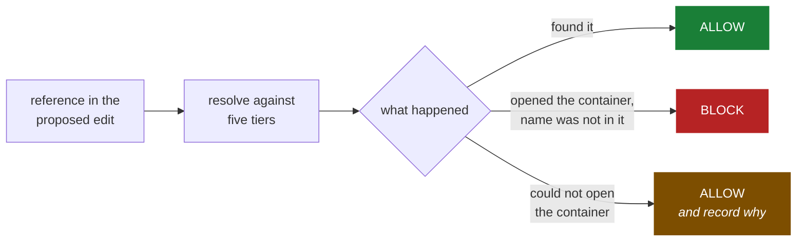

<div align="center">

# bleurs

**A deterministic firewall for AI coding agents.**

Your agent invents a package. bleurs refuses the write — before it touches disk.

[](https://github.com/Anandb71/Bleurs/actions/workflows/ci.yml)


[](LICENSE)



</div>

Look at what is **not** in that output.

`03_clean.py` was checked and produced nothing. It is deliberately full of the
patterns that make naive checkers fire — a shadowed module name, a guarded
optional import, dynamic attribute access, a submodule reached through its
parent binding. Catching invented packages is easy if you are willing to be
wrong sometimes. That silence is the hard part, and it is the entire product.

---

## Quickstart

```bash
uvx --from git+https://github.com/Anandb71/Bleurs bleurs demo
```

Zero dependencies, nothing to provision, no index to build. It reads your
interpreter's own `ast` module and its own packaging metadata.

> **PyPI release pending.** Once it lands this is just `uvx bleurs demo`.

**Put it in the edit path** — this is the point. Checking after the fact is a
linter; checking before the write is a firewall.

```bash
uv tool install git+https://github.com/Anandb71/Bleurs
bleurs install-hook
```

That registers a `PreToolUse` hook on `Write`, `Edit`, and `MultiEdit`. From
then on, when your agent proposes an edit, bleurs reconstructs what the file
*would* contain, verifies every external reference in it, and rejects the tool
call if any is provably fictional. The agent gets told exactly what was wrong
and usually fixes it on the next turn:

```
Bleurs blocked this edit. These references do not exist:
  - app.py:2  from fastapi_auth_helpers import verify - no package named 'fastapi_auth_helpers' exists on PyPI
  - app.py:5  json.loads_safe - json has no attribute 'loads_safe'

Each was checked against the real environment, not guessed.
Fix the reference or install the dependency, then retry.
```

Works with anything that can run a command on a JSON payload — Cursor, Codex,
your own agent loop. It reads a tool call on stdin and answers with an exit code.

**Put it in CI:**

```bash
bleurs check src --exclude demo
```

Exit 1 if anything was blocked. `--format json` for machine output, `--explain`
to see what it could *not* verify and why.

---

## What it catches, honestly compared

|  | invented package | invented API on a real library | invented helper in your own repo | tells you the name was **never published** | works on unwritten files | zero config |
|---|:--:|:--:|:--:|:--:|:--:|:--:|
| ruff / pyflakes | ✗ | ✗ | ✗ | ✗ | ✗ | ✓ |
| mypy / pyright | partial | ✓ | ✓ | ✗ | ✗ | ✗ |
| pip-audit / safety | ✗ | ✗ | ✗ | only known CVEs | ✗ | ✓ |
| running the tests | ✓ | ✓ | ✓ | ✗ | ✗ | — |
| **bleurs** | ✓ | ✓ | ✓ | ✓ | ✓ | ✓ |

Type checkers are genuinely good at most of this column, and if you already run
pyright in strict mode you have a lot of it covered. Two things they do not do.

**They cannot tell "not installed" from "never existed."** mypy says
`Cannot find implementation or library stub for module named 'X'` whether X is a
package you forgot to install or a name no human has ever published. That
distinction is the whole security story — one is a missing dependency, the other
is an open supply-chain hole waiting for someone to register it.

**They run after the file exists.** bleurs checks the proposed content of an
edit that has not happened yet, which is the only place you can actually stop it.

---

## The one rule

> **BLOCK requires positive evidence of absence.**

Not "we couldn't find it." Not "that looks wrong." Absence, demonstrated by a
named resolver that looked inside a container it successfully opened.



That third branch is the one everyone else collapses into the second, and it is
why their tools get switched off in week two.

The asymmetry is deliberate. A missed hallucination costs one failed test run
you were going to have anyway. A false positive costs you the tool — the user
disables it, and from that moment it catches nothing, forever. **Recall is worth
spending. Precision is not.**

<details>
<summary><b>Everything bleurs deliberately stays quiet about</b></summary>

<br>

- wildcard imports (`from x import *`) — the namespace becomes unknowable
- any name rebound anywhere in the file, in all six forms Python offers
- anything inside a `try/except` that would catch it failing
- anything inside a platform or version test (`sys.platform`, `os.name`, `platform.system()`, `sys.version_info`)
- modules with a PEP 562 `__getattr__` — they synthesize attributes on demand, so `dir()` proves nothing
- attribute chains rooted at anything but a module binding (`f().x`, `d["k"].y`)
- files that fail to parse — a syntax error is not a hallucination, and Python's own message is better than ours
- packages whose registry lookup failed for network reasons
- any project-local module it could not index

`bleurs check --explain` tells you which of these applied to your file. Silently
skipping a check is the one thing worse than a false positive.

</details>

---

## How it resolves things

Five tiers, cheapest and most certain first. Each answers *present*, *absent*,
or *I don't know* — and only the middle answer can block.

| Tier | Source of truth | Runs code? | Catches |
|---|---|:--:|---|
| **0 · local** | your project's files, parsed | no | helpers the agent invented in your own codebase |
| **1 · stdlib** | `sys.stdlib_module_names` | no | fake stdlib modules |
| **2 · env** | installed distribution metadata | no | packages that aren't there |
| **3 · introspect** | the real library object | **yes**, sandboxed | **fake APIs on real libraries** |
| **4 · registry** | PyPI, cached on disk | no | invented packages · slopsquatting bait |

Tier 3 is the one nothing else does, and it catches the failure mode that
survives code review: the import is fine, the library is real, and the method is
fiction.

It is also the only tier that executes third-party code, because there is no
other way to ask an object what it contains. That happens in an isolated
subprocess with a timeout, batched once per check run rather than once per
reference, and only for packages already installed in your environment — code
you were about to import anyway. `--no-introspect` turns it off, and bleurs then
says plainly that it verified no APIs rather than pretending the file is clean.

**Speed:** ~300 ms to check one file end-to-end, ~200 ms of which is Python
interpreter startup. Registry answers are cached on disk, so the network is hit
once per package name, ever.

---

## Why this doesn't get fixed by better models

A 2026 study measured package hallucination across five frontier models —
Claude Sonnet 4.6, Claude Haiku 4.5, GPT-5.4-mini, Gemini 2.5 Pro, DeepSeek
V3.2 — over 199,845 prompts.

| | |
|---|---|
| Hallucination rate | **4.62% – 6.10%** |
| Spread between best and worst model | 1.48 pts, down from 16.5 in the previous cohort |
| Models that beat GPT-4 Turbo's older ~3.6% | **none** |
| Package names invented *identically* by all five | **127** |

Everyone converged. Nobody improved. And those 127 shared inventions are exactly
what makes the attack economical: an adversary registers the name once and waits
for five different models to recommend it.

This is not a knowledge problem that scale fixes. It is a grounding problem, and
grounding is a job for a deterministic checker.

---

## Why not just…

<details>
<summary><b>…use mypy or pyright?</b></summary>

<br>

Do, they're excellent. They need configuration, they need stubs for untyped
dependencies, they benefit enormously from annotations, and they run on files
that exist. bleurs needs none of that and runs on the proposed edit.

More importantly, a type checker cannot distinguish a package you forgot to
install from one that was never published. That distinction is the difference
between a missing dependency and a supply-chain vulnerability.

They compose well: pyright for types, bleurs for grounding.

</details>

<details>
<summary><b>…just run the code?</b></summary>

<br>

You will, and it will catch these. The question is when. An import error surfaces
at import time; an invented method three branches deep surfaces the first time
that branch runs, which may be in production. And by then the agent has written
four more files on top of the mistake.

The value is in the position, not the cleverness — 300 ms before the write beats
four minutes into a test run beats a week into staging.

</details>

<details>
<summary><b>…you import arbitrary packages to check them. For a security tool?</b></summary>

<br>

Fair, and it's the sharpest objection to the design.

The mitigation is scope: tier 3 only ever imports packages **already installed in
your environment** — code that was going to execute the moment you ran your
program. It does not install anything, does not touch the network, and never
imports a name it just learned about. Anything not installed is settled by
metadata and the registry, with no execution at all.

It runs in a subprocess launched with `-I` (isolated mode), with a timeout, so a
package that hangs, prints, or calls `sys.exit` on import cannot take the checker
with it. `--no-introspect` disables the tier entirely, and bleurs then reports
that it verified no APIs instead of implying the file was checked.

</details>

<details>
<summary><b>…won't this slow my agent down?</b></summary>

<br>

~300 ms per edit, most of it Python startup. Set against an agent turn measured
in seconds and a wrong-turn recovery measured in minutes, it is not close.

If it matters to you, `--offline --no-introspect` runs in ~200 ms and still
catches invented packages that aren't installed.

</details>

<details>
<summary><b>…what happens when it's wrong?</b></summary>

<br>

Two failure directions, treated very differently.

A **missed** hallucination is a normal miss — `--explain` will usually tell you
it abstained and why. Open an issue if it should have been catchable.

A **false positive** is the highest-priority bug class in this repo and gets
fixed before features. `tests/test_no_false_positives.py` is written first,
kept first, and gates every pull request.

</details>

---

## What this is not

- **Not a semantic checker.** It proves a symbol exists. It cannot tell you the
  right symbol is being used the wrong way. The 2026 AST-validation paper that
  measured this approach reports 100% precision and 87.6% recall on reference
  hallucinations, and **0% correction** on contextual mismatches. That boundary
  is real and bleurs sits firmly on one side of it.
- **Not a type checker.** Narrower question, no configuration, no annotations.
- **Not multi-language yet.** Python only. The front-end interface is already
  factored for tree-sitter backends — see the roadmap.

### The one place a false positive can still get in

If an import name is not installed, not stdlib, not project-local, not in
[`aliases.py`](src/bleurs/truth/aliases.py), and has no PyPI project of that
name, bleurs blocks it. The residual risk is a real package whose import name
differs from its distribution name and which is missing from that table —
`import cv2` shipping from `opencv-python`, but one nobody has listed yet.

That table is the highest-value contribution anyone can make here, and it is a
one-line PR. Run `--no-strict-imports` to downgrade every registry-based block
to a warning if you want the guarantee absolute.

---

## It found this bug in itself

On the very first CI run, the job that checks bleurs against its own source
failed on Linux:

```
BLOCK 44:19 ctypes.windll.kernel32 — ctypes has no attribute 'windll'
```

Correct evidence, wrong conclusion. `report.py` reaches for `ctypes.windll` to
enable ANSI colours on Windows, inside a `try/except`, and that attribute really
is absent on Linux. But the author had already said in code that it might be:

```python
try:
    return ctypes.windll.kernel32.GetStdHandle(-11)
except Exception:
    return None
```

Reporting that would be telling them something they knew, about code that is
correct. The fix generalized the old try/except-`ImportError` special case into
a full guarded-reference rule covering exception handlers matched per reference
kind and platform/version conditionals on both branches. Seven regression tests,
[three commits](https://github.com/Anandb71/Bleurs/commit/c64bcb7).

This is the class of bug that decides whether a tool like this is usable, and
the reason the dogfood job exists.

---

## Roadmap

- **tree-sitter front-ends** for TypeScript, Go, and Rust behind the existing
  `Analyzer` interface. npm has the same slopsquatting problem with a bigger
  blast radius. The hard part isn't parsing — it's finding what plays the role
  of `importlib.metadata` and runtime introspection in each language.
- **SCIP ingestion** so tier 0 consumes an existing [SCIP](https://scip-code.org/)
  index instead of walking the filesystem, inheriting real cross-file name
  resolution rather than reimplementing it badly.
- **A recall benchmark** against a public corpus of model-generated code, so
  "87.6%" becomes a number this repo measures instead of one it cites.
- **Retrieval.** Once you can prove what exists, you can start fetching it
  instead of generating it.

---

## Prior art, and credit where it's owed

bleurs is a small idea standing on a lot of other people's work. If you are
building in this space, read these before you read my code.

| | |
|---|---|
| [**SCIP**](https://sourcegraph.com/blog/announcing-scip) · Sourcegraph | The code-intelligence index format this should consume rather than reinvent. Also [LSIF](https://lsif.dev/), its predecessor. |
| [**Stack Graphs**](https://arxiv.org/pdf/2211.01224) · GitHub | Incremental name resolution at scale — the right answer to what tier 0 does crudely. |
| [**Glean**](https://glean.software/) · Meta, and **Kythe** · Google | Typed, schema-defined fact databases about source code. |
| [**Coccinelle**](https://lwn.net/Articles/315686/) | Semantic patches for C. Twenty years ahead of the current conversation about AST-level edits. |
| [**OpenRewrite**](https://docs.openrewrite.org/) · Moderne | Lossless semantic trees and recipe-based transformation. |
| [**Automated Software Transplantation**](https://dl.acm.org/doi/10.1145/2771783.2771796) · Barr, Harman, Jia, Marginean, Petke (ISSTA 2015) | µSCALPEL moved the H.264 codec from x264 into VLC automatically, in 26 hours against 20 days by hand. Required reading for anyone who thinks "retrieve the code instead of generating it" is a new idea. |
| [**ast-grep**](https://ast-grep.github.io/) and [**tree-sitter**](https://tree-sitter.github.io/) | What the non-Python front-ends will be built on. |
| [**Serena**](https://github.com/oraios/serena) | LSP-backed semantic tooling for agents; solves the retrieval half of this problem well. |
| [arXiv:2601.19106](https://arxiv.org/abs/2601.19106) | *Detecting and Correcting Hallucinations in LLM-Generated Code via Deterministic AST Analysis* — the introspection-based validation approach tier 3 implements, and the source of the precision/recall figures above. |
| [arXiv:2605.17062](https://arxiv.org/abs/2605.17062) | *The Range Shrinks, the Threat Remains* — the 2026 frontier-cohort package hallucination measurements. |

---

## Contributing

See [CONTRIBUTING.md](CONTRIBUTING.md). The short version: every pull request
must keep `tests/test_no_false_positives.py` green. If your change catches more
hallucinations but makes bleurs blame correct code, the change is wrong.

Good first contributions: a missing pair in [`aliases.py`](src/bleurs/truth/aliases.py),
a false positive you hit in the wild, or a language front-end.

## License

MIT © [Anand Biju](https://github.com/Anandb71)
